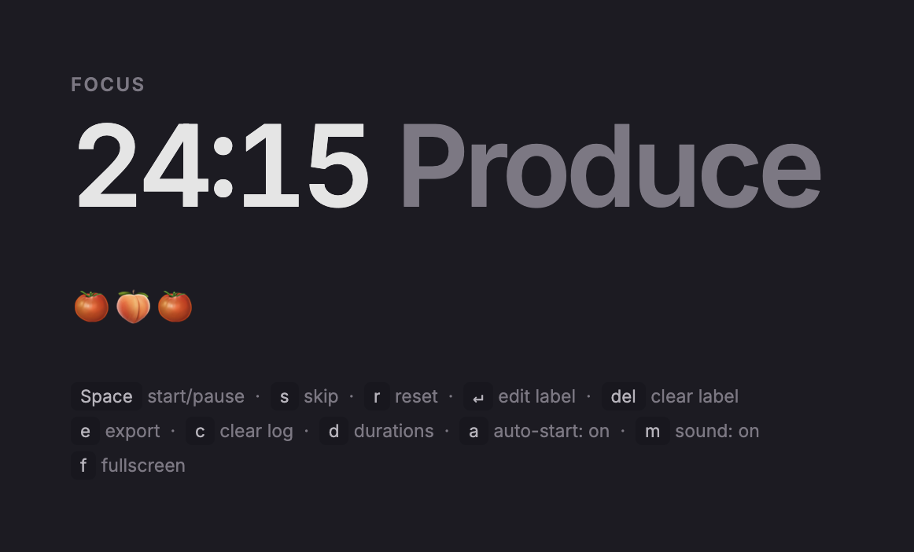

# pomodoro 🍅

Browser-based Pomodoro timer for my personal use. Vibe coded with [Claude](https://claude.ai).

## what it does

- Single-file Pomodoro timer: 25-min focus / 5-min break, with an optional 20-min long break every 4th session
- Logs completed sessions (🍅) and skipped ones (🍑); hover over any entry for labels and timestamp

## how to use it

| key | action |
|-----|--------|
| `Space` | start / pause |
| `s` | skip |
| `r` | reset |
| `↵` | edit session label |
| `del` | clear label |
| `e` | export |
| `c` | clear log |
| `d` | set durations |
| `a` | cycle auto-start (off → breaks → on) |

Press `e` to download a `.ics` calendar file of your completed focus sessions.