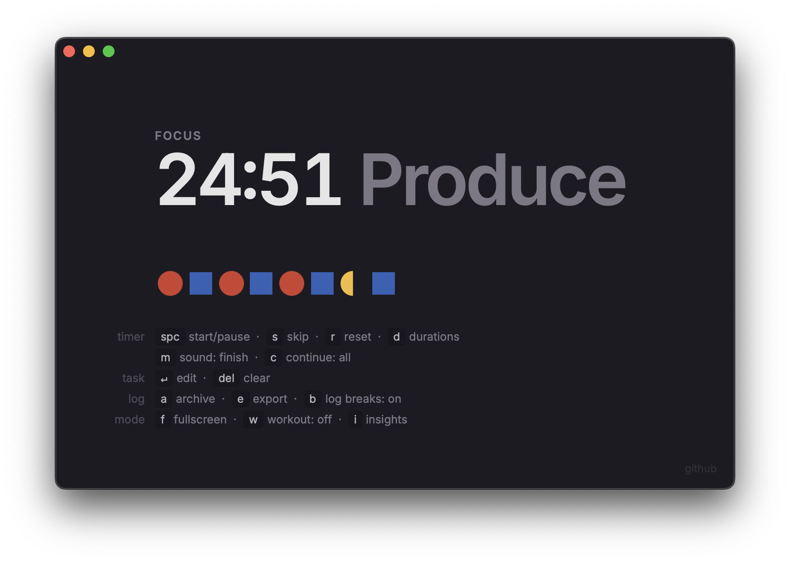

# 🔴🟡🟦 pomodoro 

Browser-based Pomodoro timer for my personal use. Should work well as a progressive web app or just live in a tab.  
Vibe coded with [Claude](https://claude.ai).

## what it does

- Single-file Pomodoro timer: configurable focus / break durations, with an optional long break every N sessions
- Logs completed (🔴), skipped (🟡), and break (🟦) sessions; click any entry to view details, edit its label, or delete it
- Export sessions to calendar: `e` for a single summary event, `E` for one event per session

## how to use it

| key | action |
|-----|--------|
| `Space` | start / pause |
| `s` | skip |
| `r` | reset |
| `↵` | edit session label |
| `del` | clear label |
| `e` / `E` | export calendar (summary / detailed) |
| `c` | clear log |
| `d` | set durations |
| `a` | cycle auto-start (off → breaks → on) |
| `m` | cycle sound (on → finish → off) |
| `b` | toggle break logging |
| `f` | toggle fullscreen |
| `w` | workout mode |
| `i` | toggle insights panel |
| `h` / margin double click | toggle instruction visibility |

## workout mode

Press `w` to open the workout settings and define a list of exercises. Once saved, the timer cycles through them automatically — focus → rest → next exercise — and stops after the last rest.

The popup also lets you disable long breaks for the workout and shows an estimated total duration.
